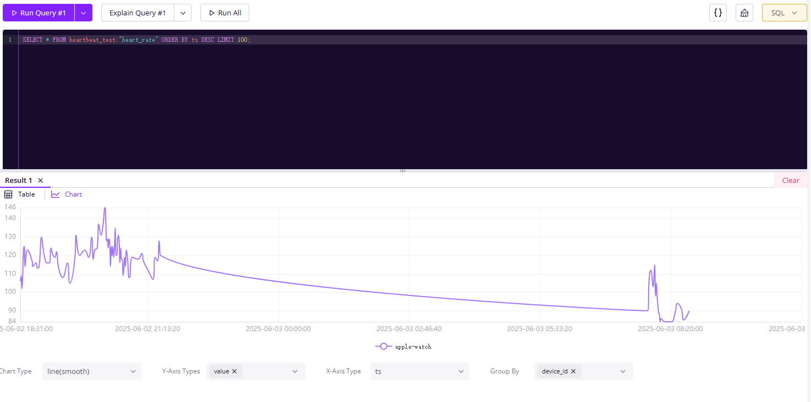

# heart-rate-proxy
[中文](README_CN.md)

This project is a toy tool for forwarding Apple Watch heart rate data to a GreptimeDB database. The service is built on the `axum` framework, provides HTTP interfaces, and supports asynchronous processing with high-performance data transfer.

## Dependencies

- Rust 2021 Edition
- axum 0.7
- tokio 1.0
- tower & tower-http
- serde
- reqwest
- chrono
- regex

## Quick Start

1. **Clone the repository**
   ```bash
   git clone https://github.com/zqr10159/heartbeat-greptime.git
   cd heartbeat-greptime

2. **Build and run**
   ```bash
   cargo run
   ```
3. **Configuration and Usage**
    - **Mobile Configuration**
      - Configure the shortcut: [iCloud Shortcut](https://www.icloud.com/shortcuts/2dc5d3614f204dd6af396d04c773bfbf), modify the URL to match your server address.
      - In the Shortcuts app, add an automation trigger, such as daily or hourly tasks, to ensure heart rate data is sent to the server automatically.
    - **Server Configuration**
      - Modify environment variables `GREPTIME_URL` and `GREPTIME_DB` as needed. If the database requires authentication, modify the code to add authentication headers, refer to [GreptimeDB Documentation](https://docs.greptime.cn/user-guide/ingest-data/for-iot/influxdb-line-protocol).

4. **Screenshot of Results**
    - Access the `GreptimeDB dashboard` via a web browser to view heart rate data graphs. 

## License
This project is licensed under the Apache 2.0 License, see [LICENSE](./LICENSE) for details.